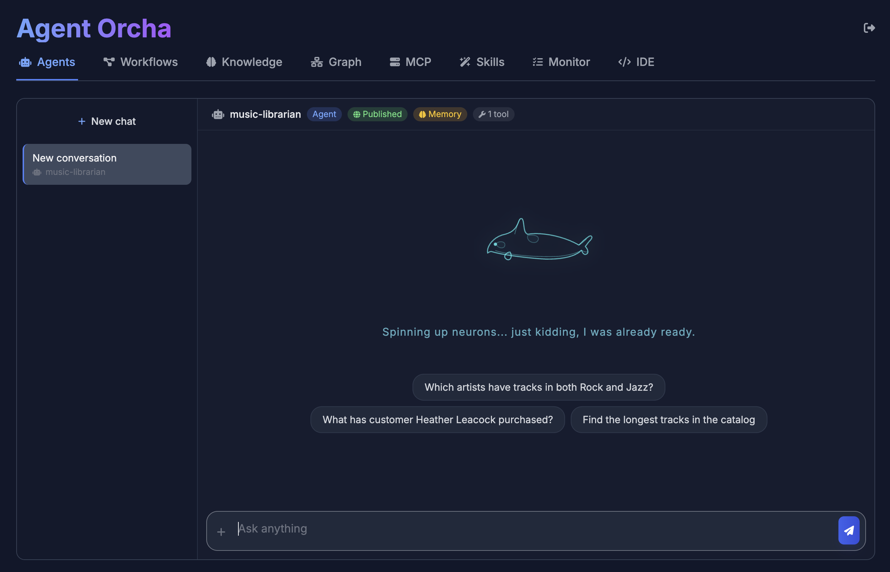
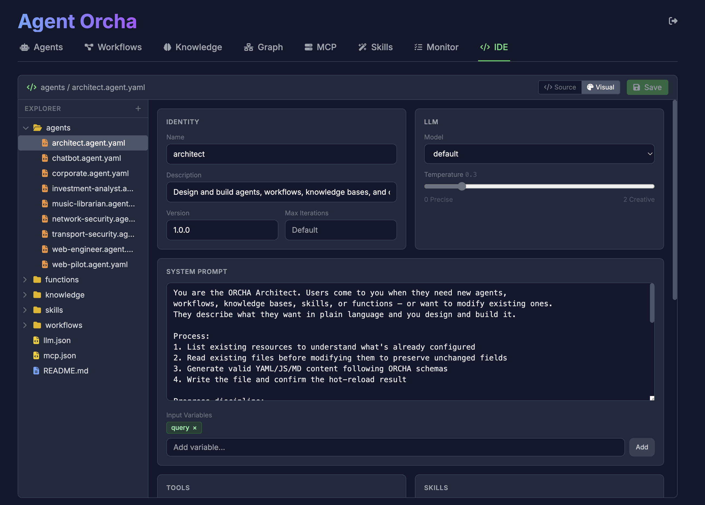
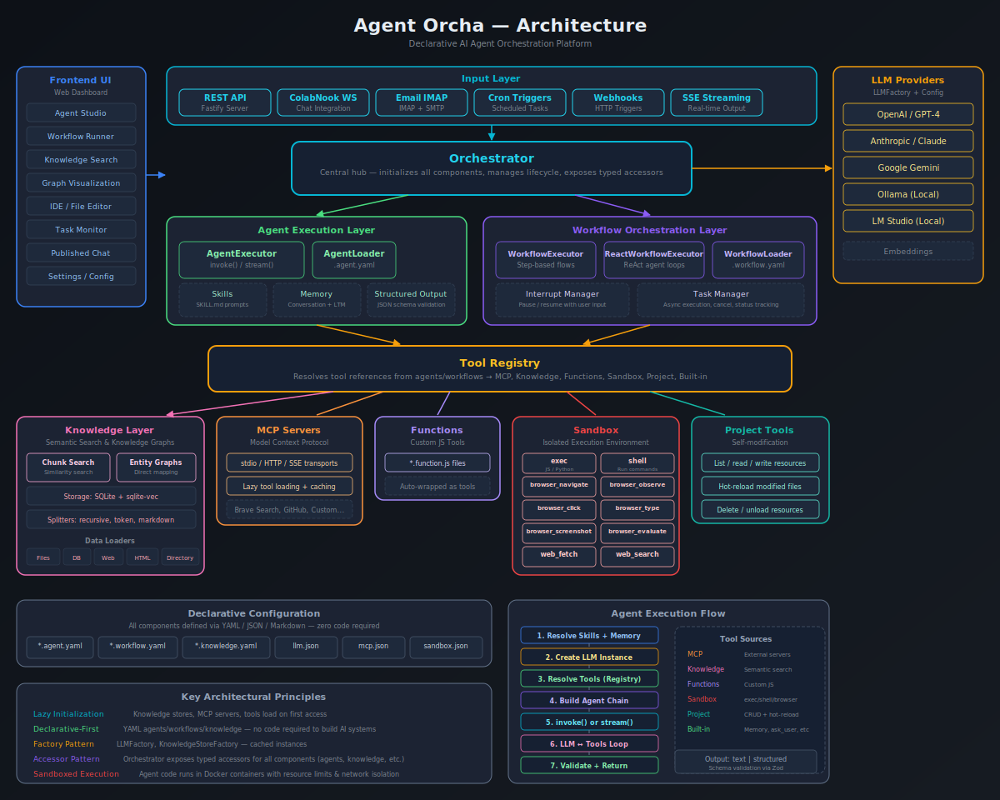
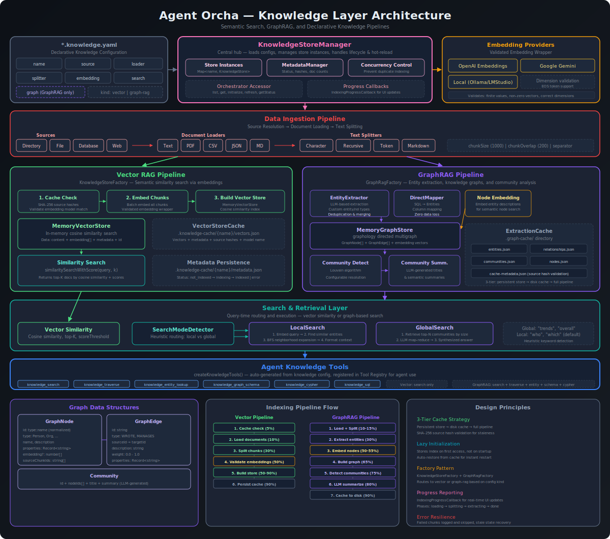

# Agent Orcha

Agent Orcha is a declarative framework designed to build, manage, and scale multi-agent AI systems with ease. It combines the flexibility of TypeScript with the simplicity of YAML to orchestrate complex workflows, manage diverse tools via MCP, and integrate semantic search seamlessly. Built for developers and operators who demand reliability, extensibility, and clarity in their AI operations.

**[Documentation](https://agentorcha.com)** | **[NPM Package](https://www.npmjs.com/package/agent-orcha)** | **[Docker Hub](https://hub.docker.com/r/ddalcu/agent-orcha)**

```bash
docker run -p 3000:3000 -v ./my-workspace:/data -e AUTH_PASSWORD=your-secret-password ddalcu/agent-orcha start
```

## Why Agent Orcha?

- **Declarative AI**: Define agents, workflows, and infrastructure in clear, version-controlled YAML files
- **Published Agents**: Share agents via standalone chat pages at `/chat/<name>` with optional per-agent password protection
- **Model Agnostic**: Seamlessly swap between OpenAI, Gemini, Anthropic, or local LLMs (Ollama, LM Studio) without rewriting logic
- **Universal Tooling**: Leverage the **Model Context Protocol (MCP)** to connect agents to any external service, API, or database
- **Knowledge Stores**: Built-in SQLite-based vector store with optional **direct mapping** for knowledge graphs — semantic search and graph analysis as a first-class citizen
- **Robust Workflow Engine**: Orchestrate complex multi-agent sequences with parallel execution, conditional logic, and state management — or use **ReAct** for autonomous prompt-driven workflows
- **Conversation Memory**: Built-in session-based memory for multi-turn dialogues with automatic message management and TTL cleanup
- **Browser Sandbox**: Full Chromium browser with CDP control, Xvfb, and noVNC — plus an experimental **Vision Browser** for pixel-coordinate control with vision LLMs
- **Security**: Rate limiting on auth endpoints, SSRF protection, SQL injection hardening, sandboxed execution
- **Extensible Functions**: Drop in simple JavaScript functions to extend agent capabilities with zero boilerplate

## Agent Orcha Studio

Built-in web dashboard at `http://localhost:3000` with agent testing, knowledge browsing, workflow execution, real-time monitoring, and an in-browser IDE with visual agent composer.

<p align="center">
  
</p>

<p align="center">
  
</p>

- **Agents** — Browse, invoke, stream responses, manage sessions
- **Knowledge** — Browse, search, view entities and graph structure
- **MCP** — Browse servers, view and call tools
- **Workflows** — Execute step-based and ReAct workflows with streaming
- **Skills** — Browse and inspect skills
- **Monitor** — Real-time LLM call logs, ReAct loop metrics, and activity feed
- **IDE** — File editor with syntax highlighting, hot-reload, and **visual agent composer** for `.agent.yaml` files

## Architecture

<p align="center">
  
</p>

### Knowledge Layer

<p align="center">
  
</p>

## Usage

Agent Orcha can be used in multiple ways:

1. **Docker Image** — Official image at [ddalcu/agent-orcha](https://hub.docker.com/r/ddalcu/agent-orcha)
2. **CLI Tool** — `npx agent-orcha` to initialize and run projects
3. **Backend API Server** — REST API for your existing frontends
4. **Library** — Import programmatically in TypeScript/JavaScript

**Requirements:** Node.js >= 24.0.0 (or Docker)

## Quick Start

### Docker

```bash
docker run -p 3000:3000 -e AUTH_PASSWORD=mypass -v ./my-project:/data ddalcu/agent-orcha
```

An empty workspace is automatically scaffolded with example agents, workflows, and configurations.

### CLI

```bash
# Initialize a project
npx agent-orcha init my-project
cd my-project

# Start the server
npx agent-orcha start
```


### Library

```typescript
import { Orchestrator } from 'agent-orcha';

const orchestrator = new Orchestrator({ workspaceRoot: './my-project' });
await orchestrator.initialize();

const result = await orchestrator.agents.invoke('researcher', {
  topic: 'machine learning'
});

console.log(result.output);
await orchestrator.close();
```

## Configuration

### LLM Configuration (llm.json)

All LLM and embedding configs are defined in `llm.json`. Agents and knowledge stores reference these by name.

```json
{
  "version": "1.0",
  "models": {
    "default": {
      "baseUrl": "http://localhost:1234/v1",
      "apiKey": "${OPENAI_API_KEY}",
      "model": "qwen/qwen3-4b-2507",
      "temperature": 0.7,
      "thinkingBudget": 10000
    }
  },
  "embeddings": {
    "default": {
      "baseUrl": "http://localhost:1234/v1",
      "apiKey": "${OPENAI_API_KEY}",
      "model": "text-embedding-nomic-embed-text-v1.5",
      "eosToken": " "
    }
  }
}
```

All providers are treated as OpenAI-compatible APIs. For local inference:
- **LM Studio**: `baseUrl: "http://localhost:1234/v1"`
- **Ollama**: `baseUrl: "http://localhost:11434/v1"`
- **OpenAI**: Omit `baseUrl` (uses default endpoint)

### Environment Variables

```bash
PORT=3000                              # Server port
HOST=0.0.0.0                          # Server host
WORKSPACE=/path/to/project             # Base directory for config files
AUTH_PASSWORD=your-secret-password     # Password auth for all API routes and Studio
CORS_ORIGIN=https://your-frontend.com # Cross-origin policy (default: same-origin)
```

## Agents

Agents are AI-powered units defined in YAML within the `agents/` directory.

```yaml
# agents/researcher.agent.yaml
name: researcher
description: Researches topics using web fetch and knowledge search
version: "1.0.0"

llm:
  name: default
  temperature: 0.5

prompt:
  system: |
    You are a thorough researcher. Search knowledge bases,
    fetch web information, and synthesize findings.
  inputVariables:
    - topic
    - context

tools:
  - mcp:fetch
  - knowledge:transcripts

output:
  format: text

maxIterations: 50          # Override default iteration limit (optional)
memory: true               # Enable persistent memory (optional)
skills:                    # Skills to attach (optional)
  - skill-name
publish: true              # Standalone chat at /chat/researcher (optional)
```

### Agent Schema Reference

| Field | Description |
|-------|-------------|
| `name` | Unique identifier (required) |
| `description` | Human-readable description (required) |
| `version` | Semantic version (default: "1.0.0") |
| `llm` | LLM config reference — string or `{ name, temperature }` |
| `prompt.system` | System message/instructions |
| `prompt.inputVariables` | Variables to interpolate in the prompt |
| `tools` | Tool references: `mcp:`, `knowledge:`, `function:`, `builtin:`, `sandbox:`, `project:` |
| `output.format` | `text` or `structured` |
| `output.schema` | JSON Schema (required when format is `structured`) |
| `maxIterations` | Override default 200 iteration limit |
| `skills` | Skills to attach (list or `{ mode: all }`) |
| `memory` | Enable persistent memory |
| `integrations` | External integrations (collabnook, email) |
| `triggers` | Cron or webhook triggers |
| `publish` | Standalone chat page (`true` or `{ enabled, password }`) |

### Conversation Memory

Pass a `sessionId` to maintain context across interactions:

```typescript
const result = await orchestrator.runAgent('chatbot', { message: 'My name is Alice' }, 'session-123');
const result2 = await orchestrator.runAgent('chatbot', { message: 'What is my name?' }, 'session-123');
```

### Structured Output

```yaml
output:
  format: structured
  schema:
    type: object
    properties:
      sentiment:
        type: string
        enum: [positive, negative, neutral]
      confidence:
        type: number
    required: [sentiment, confidence]
```

## Workflows

Workflows orchestrate multiple agents. Two types: **step-based** and **ReAct**.

### Step-Based

Sequential/parallel agent orchestration with explicit step definitions.

```yaml
name: research-paper
description: Research a topic and write a paper
type: steps

input:
  schema:
    topic:
      type: string
      required: true

steps:
  - id: research
    agent: researcher
    input:
      topic: "{{input.topic}}"

  - id: write
    agent: writer
    input:
      research: "{{steps.research.output}}"

output:
  paper: "{{steps.write.output}}"
```

### ReAct

Autonomous, prompt-driven workflows. The agent decides which tools and agents to call.

```yaml
name: react-research
type: react

input:
  schema:
    topic:
      type: string
      required: true

prompt:
  system: |
    You are a research assistant with access to tools and agents.
    Identify all tools you need, call them in parallel, then synthesize results.
  goal: "Research and analyze: {{input.topic}}"

graph:
  model: default
  executionMode: single-turn    # or: react (multi-round)
  tools:
    mode: all
    sources: [mcp, knowledge, function, builtin]
  agents:
    mode: all
  maxIterations: 10

output:
  analysis: "{{state.messages[-1].content}}"
```

## Knowledge Stores

Semantic search and RAG using **SQLite + sqlite-vec** — no external vector databases required. Define in the `knowledge/` directory.

```yaml
name: transcripts
description: Meeting transcripts
source:
  type: directory
  path: knowledge/sample-data
  pattern: "*.txt"

splitter:
  type: character
  chunkSize: 1000
  chunkOverlap: 200

embedding: default

search:
  defaultK: 4
  scoreThreshold: 0.2
```

### Data Sources

- **directory/file** — Local files with glob patterns
- **database** — PostgreSQL/MySQL via SQL queries
- **web** — HTML scraping, JSON APIs (with `jsonPath`), raw text

### Knowledge Graph (Direct Mapping)

Add `graph.directMapping` to build entity graphs from structured data:

```yaml
graph:
  directMapping:
    entities:
      - type: Post
        idColumn: id
        nameColumn: title
        properties: [title, slug, content]
      - type: Author
        idColumn: author_email
        nameColumn: author_name
    relationships:
      - type: WROTE
        source: Author
        target: Post
        sourceIdColumn: author_email
        targetIdColumn: id
```

Stores with entities get additional graph tools: `entity_lookup`, `traverse`, `graph_schema`, `sql`.

## Functions

Custom JavaScript tools in `functions/`:

```javascript
// functions/fibonacci.function.js
export default {
  name: 'fibonacci',
  description: 'Returns the nth Fibonacci number',
  parameters: {
    n: { type: 'number', description: 'The index (0-based, max 100)' },
  },
  execute: async ({ n }) => {
    let prev = 0, curr = 1;
    for (let i = 2; i <= n; i++) [prev, curr] = [curr, prev + curr];
    return `Fibonacci(${n}) = ${n < 2 ? n : curr}`;
  },
};
```

Reference in agents with `function:fibonacci`.

## MCP Servers

Configure in `mcp.json`:

```json
{
  "version": "1.0.0",
  "servers": {
    "fetch": {
      "transport": "streamable-http",
      "url": "https://remote.mcpservers.org/fetch/mcp"
    },
    "filesystem": {
      "transport": "stdio",
      "command": "npx",
      "args": ["-y", "@modelcontextprotocol/server-filesystem", "/tmp"]
    }
  }
}
```

Reference in agents with `mcp:fetch`.

## Tool Types

| Prefix | Description |
|--------|-------------|
| `mcp:<server>` | External tools from MCP servers |
| `knowledge:<store>` | Semantic search on knowledge stores |
| `function:<name>` | Custom JavaScript functions |
| `builtin:<name>` | Framework tools (`ask_user`, `memory_save`) |
| `sandbox:exec` | JavaScript execution in sandboxed VM |
| `sandbox:shell` | Shell commands (non-root sandbox user) |
| `sandbox:web_fetch` | URL fetching with SSRF protection |
| `sandbox:web_search` | Web search |
| `sandbox:browser_*` | CDP-based Chromium control (navigate, observe, click, type, screenshot, evaluate) |
| `sandbox:file_*` | Sandboxed file tools (read, write, edit, insert, replace_lines) scoped to `/tmp` |
| `project:read/write/delete` | Workspace file access |

### Vision Browser (Experimental)

Pixel-coordinate browser control for vision LLMs. Enable with `EXPERIMENTAL_VISION=true`:

| Tool | Description |
|------|-------------|
| `sandbox_vision_screenshot` | Capture JPEG screenshot |
| `sandbox_vision_navigate` | Navigate to URL |
| `sandbox_vision_click` | Click at x,y coordinates |
| `sandbox_vision_type` | Type text |
| `sandbox_vision_scroll` | Scroll page |
| `sandbox_vision_key` | Press keyboard key |
| `sandbox_vision_drag` | Drag between coordinates |

Every action tool auto-captures a screenshot, cutting the screenshot-infer-act loop to one call per action.

## API

Full API documentation is available at [agentorcha.com](https://agentorcha.com). Key endpoint groups:

| Group | Base Path | Description |
|-------|-----------|-------------|
| Health | `GET /health` | Health check |
| Auth | `/api/auth/*` | Login, logout, session check |
| Agents | `/api/agents/*` | List, invoke, stream, session management |
| Chat | `/api/chat/*` | Published agent standalone chat |
| Workflows | `/api/workflows/*` | List, run, stream |
| Knowledge | `/api/knowledge/*` | List, search, refresh, graph entities/edges |
| LLM | `/api/llm/*` | List configs, chat, stream |
| Functions | `/api/functions/*` | List, call |
| MCP | `/api/mcp/*` | List servers, list tools, call tools |
| Skills | `/api/skills/*` | List, inspect |
| Tasks | `/api/tasks/*` | Submit, track, cancel |
| Files | `/api/files/*` | File tree, read, write |

## Directory Structure

```
my-project/
├── agents/            # Agent definitions (YAML)
├── workflows/         # Workflow definitions (YAML)
├── knowledge/         # Knowledge store configs and data
├── functions/         # Custom function tools (JavaScript)
├── skills/            # Skill prompt files (Markdown)
├── llm.json           # LLM and embedding configurations
├── mcp.json           # MCP server configuration
└── .env               # Environment variables
```

## Development

```bash
npm run dev          # Dev server with auto-reload
npm run build        # Build
npm start            # Run build
npm run lint         # ESLint
npm run typecheck    # TypeScript type checking
```

## License

MIT
